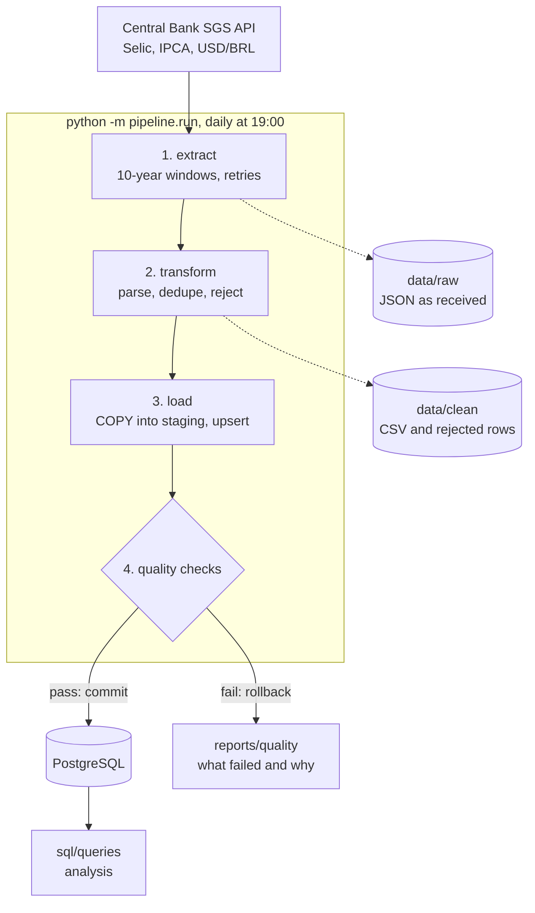

# Brazil Economic Data Pipeline

[](https://github.com/JoaoPedro0305/brazil-economic-data-pipeline/actions/workflows/tests.yml) [](https://github.com/JoaoPedro0305/brazil-economic-data-pipeline/actions/workflows/live-data.yml)

A daily data pipeline that collects Brazilian economic indicators (Selic rate, IPCA inflation and the dollar) from the Central Bank's public API, loads them into PostgreSQL and refuses to load data that breaks known rules.

Economic data is public but scattered across API calls with quirks: request limits, date formats, error pages disguised as success. This project turns it into a clean database that updates itself every day and answers questions with plain SQL.

**Highlights**

- **26 years of data, 16,822 observations**, loaded from scratch in about 50 seconds; the daily incremental run takes under a second.
- **Idempotent loads:** running twice changes nothing, and values the Central Bank revises are updated and recorded.
- **8 quality checks gate every load**, with thresholds calibrated on the real history. Bad data is rolled back before it reaches the database.
- **Runs itself:** Docker Compose starts PostgreSQL and the pipeline; [supercronic](https://github.com/aptible/supercronic) runs it daily at 19:00 Brasília time, with a health check.
- **62 tests** on Python 3.11, 3.12 and 3.13 against a real PostgreSQL in CI, plus a weekly run against the live API.

## Architecture



Each series goes through the same steps in one database transaction. The raw API response and the clean table are kept on disk, so a run can be inspected or replayed without calling the API again. The quality checks run on the full series as it would look after the load, before anything is committed.

## What the data shows

Three questions that need more than one series, answered with SQL in [`sql/queries/`](sql/queries/) (`python -m pipeline.queries` prints them as Markdown). Each query is tested on synthetic data with a known answer.

### 1. Does a higher Selic strengthen the real?

[`01_dollar_by_selic_cycle.sql`](sql/queries/01_dollar_by_selic_cycle.sql) finds every Copom decision (a day the target changed), groups consecutive decisions in the same direction into cycles with window functions, and looks up the dollar before and after each cycle with `LATERAL` joins.

| Cycle | Period | Decisions | Selic | USD/BRL | Dollar |
|---|---|---|---|---|---|
| cut | Mar 2000 to Jan 2001 | 6 | 19.00% to 15.25% | 1.75 to 1.95 | +11.9% |
| hike | Mar 2001 to Jul 2001 | 5 | 15.25% to 19.00% | 2.10 to 2.50 | +19.2% |
| cut | Feb 2002 to Jul 2002 | 3 | 19.00% to 18.00% | 2.43 to 2.88 | +18.5% |
| hike | Oct 2002 to Feb 2003 | 5 | 18.00% to 26.50% | 3.86 to 3.61 | -6.6% |
| cut | Jun 2003 to Apr 2004 | 9 | 26.50% to 16.00% | 2.89 to 2.91 | +0.6% |
| hike | Sep 2004 to May 2005 | 9 | 16.00% to 19.75% | 2.90 to 2.45 | -15.8% |
| cut | Sep 2005 to Sep 2007 | 18 | 19.75% to 11.25% | 2.33 to 1.95 | -16.1% |
| hike | Apr 2008 to Sep 2008 | 4 | 11.25% to 13.75% | 1.67 to 1.83 | +9.3% |
| cut | Jan 2009 to Jul 2009 | 5 | 13.75% to 8.75% | 2.35 to 1.89 | -19.6% |
| hike | Apr 2010 to Jul 2011 | 8 | 8.75% to 12.50% | 1.76 to 1.56 | -11.3% |
| cut | Sep 2011 to Oct 2012 | 10 | 12.50% to 7.25% | 1.59 to 2.04 | +28.3% |
| hike | Apr 2013 to Jul 2015 | 16 | 7.25% to 14.25% | 1.99 to 3.37 | +68.8% |
| cut | Oct 2016 to Aug 2020 | 21 | 14.25% to 2.00% | 3.18 to 5.34 | +68.0% |
| hike | Mar 2021 to Aug 2022 | 12 | 2.00% to 13.75% | 5.66 to 5.24 | -7.4% |
| cut | Aug 2023 to May 2024 | 7 | 13.75% to 10.50% | 4.81 to 5.16 | +7.3% |
| hike | Sep 2024 to Jun 2025 | 7 | 10.50% to 15.00% | 5.48 to 5.49 | +0.2% |
| cut | Mar 2026 to Sep 2026 | 5 | 15.00% to 13.75% | 5.21 to 5.15 | -1.1% |

**Not on its own.** In the 8 hiking cycles the dollar rose in 4 and fell in 4; in the 9 cutting cycles it rose in 6. The 2013-2015 hikes, from 7.25% to 14.25%, came with the dollar up 69%, during a fiscal crisis and recession. External shocks and fiscal risk weigh more than the direction of the Selic.

### 2. What was the real interest rate each year?

[`02_real_interest_rate.sql`](sql/queries/02_real_interest_rate.sql) compounds monthly IPCA into annual inflation with `exp(sum(ln(1 + m))) - 1`, which matches IBGE's official figures (12.53% in 2002, 10.06% in 2021), and compares it with the year's average Selic target: real rate = (1 + Selic) / (1 + IPCA) - 1.

Only **2020 (-1.56%) and 2021 (-5.02%)** had a negative real rate, when the Selic was cut to 2% and inflation came back. The highest was 2003 (13.01%). The average target is an approximation of what an investor actually earned.

<details>
<summary>All years, 2000-2025</summary>

| Year | Selic (avg) | IPCA | Real rate |
|---|---|---|---|
| 2000 | 17.60% | 5.97% | 10.97% |
| 2001 | 17.46% | 7.67% | 9.09% |
| 2002 | 19.22% | 12.53% | 5.95% |
| 2003 | 23.52% | 9.30% | 13.01% |
| 2004 | 16.38% | 7.60% | 8.16% |
| 2005 | 19.14% | 5.69% | 12.72% |
| 2006 | 15.32% | 3.14% | 11.80% |
| 2007 | 12.04% | 4.46% | 7.26% |
| 2008 | 12.45% | 5.90% | 6.18% |
| 2009 | 10.14% | 4.31% | 5.59% |
| 2010 | 9.90% | 5.91% | 3.77% |
| 2011 | 11.76% | 6.50% | 4.93% |
| 2012 | 8.63% | 5.84% | 2.64% |
| 2013 | 8.29% | 5.91% | 2.25% |
| 2014 | 10.96% | 6.41% | 4.28% |
| 2015 | 13.47% | 10.67% | 2.53% |
| 2016 | 14.18% | 6.29% | 7.42% |
| 2017 | 10.15% | 2.95% | 7.00% |
| 2018 | 6.58% | 3.75% | 2.73% |
| 2019 | 6.04% | 4.31% | 1.66% |
| 2020 | 2.89% | 4.52% | **-1.56%** |
| 2021 | 4.54% | 10.06% | **-5.02%** |
| 2022 | 12.55% | 5.78% | 6.39% |
| 2023 | 13.30% | 4.62% | 8.29% |
| 2024 | 10.94% | 4.83% | 5.83% |
| 2025 | 14.42% | 4.26% | 9.74% |

</details>

### 3. Does a weaker real show up in inflation, and how fast?

[`03_dollar_pass_through.sql`](sql/queries/03_dollar_pass_through.sql) compares the dollar's change over 12 months with 12-month IPCA measured 0 to 18 months later (exchange-rate pass-through).

| Inflation measured | Months compared | Correlation with the dollar's 12-month change |
|---|---|---|
| the same month | 308 | 0.17 |
| 3 months later | 305 | 0.32 |
| 6 months later | 302 | **0.43** |
| 9 months later | 299 | **0.43** |
| 12 months later | 296 | 0.37 |
| 18 months later | 290 | 0.33 |

**With a lag of about 6 to 9 months.** The correlation is weak in the same month (0.17) and peaks at 0.43 after 6-9 months, the pattern described in the economics literature. It is a correlation, not a causal estimate: commodity prices, the output gap and the Selic itself move together with both.

## Data

Source: the Central Bank of Brazil's [SGS API](https://dadosabertos.bcb.gov.br/), public data, no key required. History starts on 2000-01-01.

| Series | SGS code | Published | Unit |
|---|---|---|---|
| Selic target rate (Copom) | 432 | every calendar day | % per year |
| IPCA inflation, monthly change | 433 | monthly, dated the 1st | % per month |
| USD/BRL exchange rate (sell) | 1 | business days | BRL per USD |

## How it works

### Extraction

[`pipeline/extract.py`](pipeline/extract.py) downloads each series and saves the response unchanged in `data/raw/<series>/<run timestamp>.json`. It handles what the live API actually does:

- **10-year limit:** daily series reject requests longer than 10 years (10 years + 1 day returns a 502), so the history is fetched in windows.
- **Empty is not an error:** a window with no data (a weekend, a future month) returns 404 "Value(s) not found", treated as an empty result.
- **Errors disguised as success:** the API sometimes answers 200 with an HTML error page. Every response must be a JSON list, and failures are retried with exponential backoff (1s, 2s, 4s).

### Transformation

[`pipeline/transform.py`](pipeline/transform.py) turns raw records into `series`, `ref_date`, `value` and saves them in `data/clean/<series>/<run timestamp>.csv`:

- `dd/mm/yyyy` dates become ISO dates; values must be plain numbers with a dot decimal;
- **rows that cannot be parsed are not dropped silently**: they go to a `_rejected.csv` file with the reason;
- the same date twice with the same value is kept once; with different values it counts as a conflict and the last value returned wins.

On the full history the API data came back clean (nothing rejected, no duplicates). The rules are still tested with deliberately broken inputs.

### Load

PostgreSQL 17 runs in Docker. The schema, [`sql/schema.sql`](sql/schema.sql), is applied by the pipeline itself and is safe to run more than once.

| Table | Contents |
|---|---|
| `series` | one row per indicator: SGS code, description, unit, frequency |
| `observations` | the values; primary key `(series_id, ref_date)`, so the database itself rejects duplicate dates |
| `revisions` | values the Central Bank changed after they were first loaded (old and new value) |
| `pipeline_runs` | one row per execution: start, end, status, rows inserted/updated/rejected, per-series details as JSON |
| `quality_results` | the outcome of every quality check, for every series, in every run |

[`pipeline/load.py`](pipeline/load.py) loads each series in one transaction: `COPY` into a temporary staging table (bulk load, much faster than row-by-row inserts), record changed values in `revisions`, `UPDATE` only the values that changed, then `INSERT ... ON CONFLICT DO NOTHING` for new dates.

| | Inserted | Updated | Unchanged | Time |
|---|---|---|---|---|
| 1st load, full history | 16,822 | 0 | 0 | 1.2s |
| 2nd load, same data | 0 | 0 | 16,822 | 0.6s |

### Data quality

[`pipeline/quality.py`](pipeline/quality.py) checks each series after loading it and **before committing**. If an `error` check fails, the series is rolled back so bad data never lands, and the rest of the run continues. `warn` checks are reported without blocking.

| Check | Severity | Rule |
|---|---|---|
| `required_values` | error | no missing dates or values |
| `unique_dates` | error | one value per date |
| `value_range` | error | Selic 0-50%, IPCA -3% to 5%, USD/BRL 1-10 |
| `calendar` | error | USD only on weekdays, IPCA only on the 1st of a month |
| `no_future_dates` | error | nothing after today |
| `no_gaps` | error | Selic: no missing day. IPCA: no missing month. USD: at most 3 weekdays in a row without a quote (holidays exist) |
| `max_jump` | error | USD at most 15% between consecutive days, Selic 5 pp, IPCA 3 pp |
| `freshness` | warn | latest value at most 5 days old (USD), 3 (Selic), 75 (IPCA, published about 10 days after month end) |

**Thresholds come from the real history, with a margin.** Measured on 2000-2026: the biggest USD/BRL daily move was 9.33% (2008-10-08, financial crisis); the longest run of weekdays without a quote was 2 (Carnival); the biggest Selic move at one meeting was 3.00 pp (2002); IPCA never changed more than 1.71 pp from one month to the next. A guessed "5% per day" limit would have blocked real 2008 data. All 24 checks pass on the full history.

**Each check is proven to catch its defect.** [`tests/fixtures/quality/`](tests/fixtures/quality/) holds a clean file and one copy per planted defect (missing value, duplicate date, a Saturday, an out-of-range value, a future date, a 5-weekday gap, a 23% jump, stale data). Each test asserts that exactly the right check fails and every other check stays quiet.

Results go to `quality_results` and to a Markdown report per run (`reports/quality/latest.md`). A blocked load, from the end-to-end tests (a USD quote of 55.00):

```
usd_brl blocked: quality checks failed: value_range (1), max_jump (2)

- usd_brl / value_range (load blocked): 1 value(s) outside [1, 10] BRL per USD
  - 2026-10-07: 55.0
- usd_brl / max_jump (load blocked): 2 change(s) bigger than 15.0%
  - 2026-10-07: 5.0 -> 55.0 (+1000.0 %)
```

### Running and scheduling

[`pipeline/run.py`](pipeline/run.py) chains the steps for every series:

- **Incremental:** the first run fetches the full history; later runs start 30 days (daily series) or 90 days (IPCA) before the last loaded date. Re-fetching that window picks up revisions, and the idempotent load never duplicates rows. `--full` re-fetches everything.
- **Isolated failures:** if one series fails, the others are still loaded and committed. The run is marked `failed` and the process exits with code 1.
- **One run at a time:** a PostgreSQL advisory lock makes a concurrent run (a manual run while the scheduled one is going) skip instead of racing on the same rows.
- **Run log:** `pipeline_runs`, `quality_results`, `logs/pipeline.log` and `reports/quality/`.

`docker compose up -d` starts two containers: `economy_db` (PostgreSQL, data in a named volume) and `economy_pipeline`, which runs the pipeline once on startup and then every day at **19:00 Brasília time**, after the day's USD rate (about 13:00) and any Copom decision (about 18:30) are out.

- **Scheduler:** supercronic, a cron built for containers (regular `cron` drops environment variables and hides job output), reading a normal crontab: [`docker/crontab`](docker/crontab). The binary is pinned to a version and verified against its published SHA-256.
- **Health check:** `python -m pipeline.health` fails when the last successful run is older than 26 hours; it is the container's healthcheck, so `docker ps` shows `unhealthy` if daily runs stop succeeding.
- **Files on the host:** `data/`, `logs/` and `reports/` are mounted from the project folder.
- The container runs as an unprivileged user, and `.gitattributes` keeps LF line endings on the files that run inside it, so a Windows checkout does not break them.

The schedule was verified by running the same image with an every-minute crontab: supercronic fired the job and the run completed with 24/24 checks passing.

## Continuous integration

- **[`tests`](.github/workflows/tests.yml)**, on every push and pull request: [ruff](https://docs.astral.sh/ruff/) lint and format check (including bugbear and bandit security rules), the full suite on Python 3.11, 3.12 and 3.13 against a PostgreSQL service container, and a Docker image build. Locally, database tests are skipped when PostgreSQL is not running; in CI `REQUIRE_DB=1` turns that skip into a failure, so the badge can never be green with the database tests silently skipped.
- **[`live data`](.github/workflows/live-data.yml)**, weekly and whenever the pipeline code changes: the tests mock the API, so this job runs the real pipeline against the live API, from 2000 to today, on an empty database. A change in the API format or real data breaking a quality rule fails here. The quality report is published on the run page.
- **Dependencies** are pinned to exact versions, as is the Python base image, so every build is the same. [Dependabot](.github/dependabot.yml) opens a monthly pull request for new versions of Python packages, GitHub Actions and the base image (Python 3.13 patch releases only; moving to a new Python version is a deliberate change), and each one has to pass the CI above.
- **Changes go through pull requests:** work happens on a branch and is merged into `main` after the checks pass.

## How to run

With Docker, database and daily pipeline:

```bash
docker compose up -d --build                              # the first start loads the full history
docker compose logs -f pipeline                           # follow the runs
docker compose run --rm pipeline python -m pipeline.run   # an extra run on demand
```

Local development and tests:

```bash
python -m venv .venv
source .venv/bin/activate          # on Windows: .venv\Scripts\activate
pip install -r requirements-dev.txt
docker compose up -d db            # PostgreSQL on 127.0.0.1:5433
python -m pipeline.run
python -m pipeline.queries         # analysis queries as Markdown tables
pytest                             # database tests use a separate economy_test database
ruff check . && ruff format --check .
```

The database listens on 127.0.0.1 only, so it is reachable from this machine and not from the network, on port 5433 so it does not clash with a local PostgreSQL on 5432. Docker Compose reads overrides (user, password, port) from a `.env` file, see [`.env.example`](.env.example); the pipeline reads the connection string from the `DATABASE_URL` environment variable.

## Project structure

```
pipeline/
  config.py        series, paths, lookback windows
  extract.py       Central Bank API client
  transform.py     parsing, deduplication, rejected rows
  load.py          schema, COPY + upsert, revisions
  quality.py       the 8 checks and their thresholds
  report.py        quality_results rows and Markdown reports
  run.py           orchestration, advisory lock, run log
  health.py        container healthcheck
  queries.py       runs sql/queries as Markdown tables
sql/
  schema.sql       tables
  queries/         analysis queries
docker/            crontab and entrypoint
tests/             unit, database and end-to-end tests, quality fixtures
.github/workflows/ tests and live data
```

## Stack

| Tool | Why |
|---|---|
| Python, requests | API client with explicit retries and response validation |
| pandas | parsing and validating dates and numbers, quality checks |
| PostgreSQL 17 | constraints as a second line of defense, `COPY`, window functions, advisory locks |
| psycopg 3 | native `COPY` support and explicit transactions |
| Docker Compose | database and pipeline with one command |
| supercronic | cron that behaves inside a container |
| pytest, responses | the API is mocked, the database is real |
| GitHub Actions | tests on three Python versions and a weekly live-API check |

## Limitations and next steps

- **Three series.** Adding one means an entry in `SERIES` and its quality thresholds in `RULES`; IGP-M, unemployment or the effective Selic (SGS 11) would be natural next ones.
- **The real rate uses the average Selic target**, an approximation of what was actually earned; the effective daily Selic would be more precise.
- **No official holiday calendar.** The gap check allows up to 3 weekdays in a row without a USD quote instead of checking against the B3/ANBIMA calendar.
- **Static thresholds.** A new regime (the dollar above R$ 10, for example) would block loads until `RULES` is updated. This is deliberate: it fails loudly instead of loading suspicious data quietly.
- **Single-machine scheduling.** The pipeline runs while Docker is up on one host; a managed scheduler or an orchestrator such as Airflow would be the step for production.
- **Descriptive analysis.** The pass-through query measures correlation, not causation.

## License

Code: MIT. Data: Banco Central do Brasil, public data.
